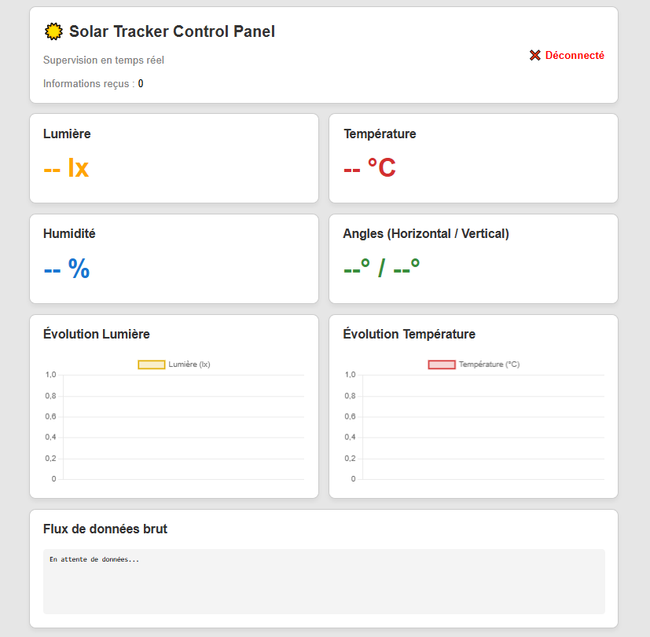

# Projet IoT Complet — Solar Tracker Dashboard

## Description

Système IoT complet pour la surveillance en temps réel de la luminosité et la visualisation des données sur Azure et sur un tableau de bord web. Le projet comprend :

- **Simulation ESP32** : script Python simulant le système KS0530 et l'ESP32, envoyant les données vers Azure.
- **Script_ESP32** : code pour l'ESP32 — envoi des données à Azure via MQTT.
- **Script_Arduino** : code pour l'Arduino — contrôle du système et envoi des données à l'ESP32 via UART.
- **Backend (FastAPI)** : serveur Python qui consomme les données depuis Azure et les diffuse en temps réel (WebSocket).
- **Frontend (HTML/JavaScript)** : tableau de bord interactif avec graphiques en temps réel.

## Architecture

```
┌───────────────────────┐
│   Suiveur solaire     │ → Température, humidité, angles, luminosité (KS0530) + commande moteurs
└────────┬──────────────┘
         │ UART
         ▼
┌───────────────────┐
│      ESP32        │ → Reçoit via UART et envoie les données à Azure (MQTT)
└────────┬──────────┘
         │ MQTT
         ▼
┌─────────────────────────────┐
│   Azure IoT Hub / EventHub  │ → Réception et stockage
└────────┬────────────────────┘
         │ AMQP
         ▼
┌──────────────────────┐
│  Backend (FastAPI)   │ → Consomme & diffuse via WebSocket
└────────┬─────────────┘
         │ WebSockets
         ▼
┌──────────────────────┐
│  Frontend (HTML/JS)  │ → Affiche le tableau de bord
└──────────────────────┘
```

## Prérequis

### Système
- Système KS0530
- ESP32
- Python 3.8+
- Arduino IDE et bibliothèques requises
- Compte Azure IoT Hub configuré

### Clés d'accès Azure
- Chaîne de connexion (Connection String) du dispositif ESP32
- Chaîne de connexion Event Hub pour le backend

### Branchement UART
- ESP32 : RX = 16, TX = 17
- Arduino : RX = D4, TX = D5

## 🚀 Déploiement (mode développement)

#### Terminal 1 — Lancer le backend

```bash
# Activer l'environnement virtuel (Windows)
venv\Scripts\activate
# (Linux/Mac) source venv/bin/activate

# Lancer FastAPI (module path vers le fichier FastAPI.py)
uvicorn Site_Web_Dashboard.BackEnd.FastAPI:app --reload --host 0.0.0.0 --port 8000
```

#### Terminal 2 — Servir le frontend

Option A — Avec Python :
```bash
cd Site_Web_Dashboard/FrontEnd
python -m http.server 3000
```

Option B — Avec l'extension Live Server (VS Code) :
- Installer l'extension "Live Server"
- Clic droit sur front_test.html → "Open with Live Server"

Accéder au tableau de bord : http://localhost:3000/front_test.html (ou l'URL fournie par Live Server)

## Configuration ESP32 (réel)

Si vous utilisez un ESP32 avec Wi‑Fi :

1. Installer les bibliothèques Arduino nécessaires :
   - Azure IoT Library for Arduino
   - WiFi101 (ou la bibliothèque adaptée à votre carte)

2. Télécharger `Script_ESP32/Script_ESP32.ino` sur l'ESP32.

3. Configurer le Wi‑Fi et Azure dans le code :
```cpp
const char* ssid = "Votre_SSID";
const char* password = "Votre_PASSWORD";
const char* iothub_hostname = "votre-hub.azure-devices.net";
const char* device_id = "SolarTracker1";
const char* sas_token = ""; // générer via Azure CLI
```

Pour générer un SAS token depuis Azure CLI :
```bash
az iot hub generate-sas-token --device-id <DEVICE_ID> --hub-name <NOM_HUB_IOT> --duration 31536000
```

## Utilisation du tableau de bord



### Fonctionnalités
- Affichage temps réel : température, humidité, luminosité, angles
- Graphiques avec Chart.js
- Mise à jour instantanée via WebSocket
- Console de logs pour le débogage

### Actions
- **Connexion automatique** : le frontend se connecte automatiquement au backend
- **Mise à jour des graphiques** : chaque donnée reçue met à jour les graphiques
- **Logs en direct** : pour surveiller la connexion et les messages

## Fichiers importants

```
projet_complet/
├── README.md
├── .env                       ← Variables d'environnement
├── simuler_ESP32.py           ← Simulation Python du dispositif
├── Scripts_Arduino_ESP32/
│   ├── Script_Arduino.ino     ← Code Arduino
│   └── Script_ESP32.ino       ← Code ESP32
└── Site_Web_Dashboard/
    ├── BackEnd/
    │   └── FastAPI.py         ← Backend (FastAPI)
    └── FrontEnd/
        └── front_test.html    ← Frontend (dashboard)
```

## Ressources utiles

- https://docs.microsoft.com/en-us/azure/iot-hub/  (Documentation Azure IoT Hub)
- https://fastapi.tiangolo.com/  (FastAPI)
- https://create.arduino.cc/iot/ (Arduino IoT Cloud)
- https://www.chartjs.org/ (Chart.js)

## Licence

Projet étudiant — usage personnel / éducatif

---

**Dernière mise à jour** : Février 2026
**Statut** : Prêt pour déploiement
